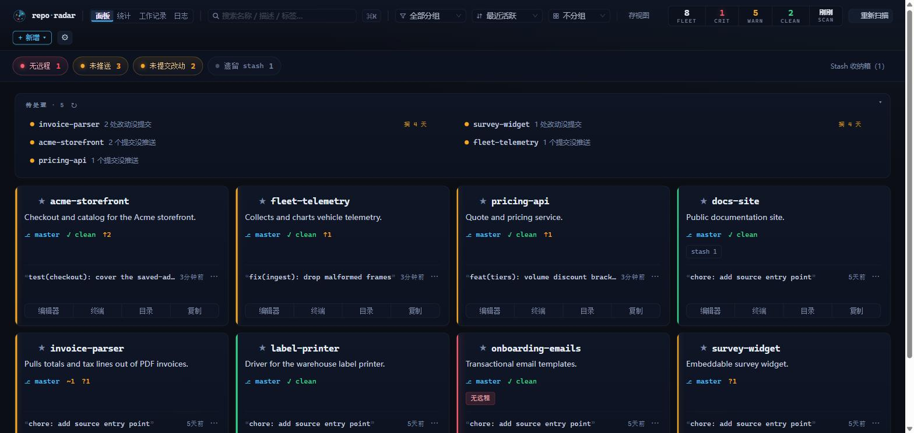

  

# repo-radar

> 一个本地面板，替你盯着所有 Git 仓库，告诉你其中哪些需要你出手。

[English](README.md) · **简体中文** · [繁體中文](docs/i18n/README.zh-Hant.md) · [日本語](docs/i18n/README.ja.md) · [한국어](docs/i18n/README.ko.md) · [Español](docs/i18n/README.es.md) · [Français](docs/i18n/README.fr.md) · [Deutsch](docs/i18n/README.de.md) · [Português](docs/i18n/README.pt.md) · [Русский](docs/i18n/README.ru.md) · [Italiano](docs/i18n/README.it.md) · [العربية](docs/i18n/README.ar.md) · [हिन्दी](docs/i18n/README.hi.md) · [বাংলা](docs/i18n/README.bn.md) · [ไทย](docs/i18n/README.th.md) · [Türkçe](docs/i18n/README.tr.md) · [Tiếng Việt](docs/i18n/README.vi.md) · [Bahasa Indonesia](docs/i18n/README.id.md)

 

[⬇ 下载 Windows · macOS · Linux 版](https://github.com/rockbenben/repo-radar/releases/latest)

你的 Git 仓库多到光靠脑子已经记不过来。repo-radar 替你盯着全部，只把此刻需要你处理的那几个挑出来——其余的就别再挂心了。

它替你翻出那些你本来会忘记去查的东西：

- **没做完的活** —— 未提交、未推送或搁进 stash 的改动，在你弄丢它们之前标出来。
- **GitHub 在等你** —— open PR、issue 和变红的 CI，通过你本机已登录的 `gh` 读取。
- **正在长草的项目** —— 太久没碰的，或是早该发版的。
- **你已经顾不过来的仓库** —— 全部在一屏之内，可搜索，点一下就能打开。

需要动手的会升到最前面形成一条队列，一个仓库一条，按紧迫度排序。点 ✓ 消掉后就不再出现，直到确实有变化才回来。

## 支持范围

| 方面 | Windows | macOS | Linux |
| --- | --- | --- | --- |
| 安装 | `.exe` 安装器 | `.dmg` | `.AppImage` |
| 关闭窗口 | 收进托盘 | 收进托盘 | 直接退出——用**开机自启**让它常驻 |
| 改动监听 | 扫描目录下的仓库全覆盖 | 同左 | 覆盖前 200 个仓库（上限可在设置里调高或取消）|

一切都在你本机运行，用的就是你机器上那个 `git`——不需要账号，没有埋点，什么都不上传。GitHub 那一列（PR、issue、CI）是可选的，读的是你已经登录好的 [`gh` CLI](https://cli.github.com/)；不用它，其余功能照常。

## 安装

从 [Releases](https://github.com/rockbenben/repo-radar/releases) 下载对应平台的文件——无需 Node.js。应用未做代码签名，因此每个系统首次运行都会告警：

- **Windows** —— 在 SmartScreen 提示上点击 *更多信息 → 仍要运行*。
- **macOS** —— 首次请右键 → 打开。如果 macOS 说它已损坏：`xattr -cr /Applications/repo-radar.app`。
- **Linux** —— 先 `chmod +x repo-radar-*.AppImage`。

不想凭信任接受一个二进制？[自己编译一份](docs/development.md)——就是 `npm install && npm start`。

首次启动点 **添加扫描目录**，指向你的仓库所在的那个**上级目录**——比如 `D:\Projects`，而不是逐个添加仓库。它会向下找 6 层以内带 `.git` 的目录，看板随即填满。无需 JSON，无需重启。

## 看板

每个仓库一张卡片——健康度色带、分支、工作区细分、ahead/behind、上次提交、标签——每张卡都带一键 **编辑器 / 终端 / 目录**。

- **找到它** —— 搜索，或按语言、`#tag`、告警灯筛选。⌘/Ctrl-K 打开启动器。
- **存成视图** —— 任意筛选 + 排序 + 分组，命名后反复用。
- **批量操作** —— 对选中的仓库 fetch / pull / push，或在它们里面执行同一条 shell 命令。单个失败绝不拖住其余的。
- **就地处理** —— 详情面板带实时 diff 提交、切换分支、丢弃改动、清理已合并分支，并按需拉取 GitHub PR 与 CI。
- **新建与迁移** —— **＋新增** 直接建好仓库并纳入看板；清单导出 / 导入让配置在不同机器间迁移。

顶栏那排灯就是告警类型——无远程、未推送、未提交、落后远程、遗留 stash。用不上的可以在 ⚙ 设置里关掉。

另有两个 tab：**统计**（一年的提交热力图、最活跃与最不活跃）和 **工作记录**（把某个日期范围复制成 Markdown 周报）。

深色仪表舱主题，本地化为 18 种语言，深浅两套主题的文字对比度均按 WCAG AA 校准。

## 保持最新

默认方式是 30 分钟一轮的兜底重扫，加上顶栏的手动重扫——纯本地、安静、不走网络。

文件监听自动扫描**默认关闭**，可在设置里自行开启。它同样纯本地，但几个项目同时在跑构建时内核通知缓冲区会持续溢出，每次溢出都要补一轮重扫——对一个「看一眼哪里变了」的工具来说，这笔常驻开销不值得。开启后，新增、删除或改名的仓库几秒内就能被发现。

改名或搬移一个仓库，它的标签、收藏、归档状态和便签都会保留。repo-radar 靠仓库内部的内容认人，不靠它放在哪里，所以换个位置它还是原来那个项目，而不是新的一个。

定时后台 fetch 需自行开启，也是唯一会主动联网的功能。

## 在后台安静运行

关闭窗口只会把 repo-radar 收进托盘，重扫、监听和 GitHub 提醒都继续跑。点托盘图标把看板唤回，或从托盘菜单真正退出。

退出时会等已经在跑的 git 操作收尾——批量 pull、丢弃 stash——上限 10 秒，以免写入被切断、留下一个过期的 `.git/index.lock`。等不到也会照样退出，并在日志里说明。

打开 **开机自启**，它就随你的会话无界面启动。可选的桌面通知只在有*新*条目进入队列时才触发。

## 配置

扫描目录、排除目录和打开方式可以在 ⚙ 设置 → 扫描与打开方式 里改。其余设置都在 `~/.repo-radar/config.json`，你很少需要打开它——完整字段表、旁边那两个缓存文件、以及用来跑第二实例的环境变量，见[配置参考](docs/configuration.md)。

## 已知限制

- **升级是刻意设计的手动方式。** 没有自动更新：用新安装包覆盖旧的即可。
- **搬走的仓库靠紧接着那一轮扫描认回来——错过那一轮，标签就跟不过去了。** 跨盘的慢速搬移，或新位置你还没加进扫描目录，都会让它以一张全新卡片回来，标签留在旧的那张上。
- **Linux 上没有可靠的托盘**，所以关闭窗口等于退出。
- **一个个手动添加、不在扫描目录里的仓库，不走这套识别** —— 搬走之后要你自己指向新路径。
- **丢弃改动不动 submodule 和嵌套的 git 仓库**，并且会如实说明，而不是报成功。

## 关于 365 开源计划

[365 开源计划](https://github.com/rockbenben/365opensource) 的第 **#027** 个项目——一个人 + AI，一年 300+ 个开源项目。

[提交你的需求 →](https://365.aishort.top/) · [Discord](https://discord.gg/PZTQfJ4GjX) · [Telegram](https://t.me/aishort_top)
