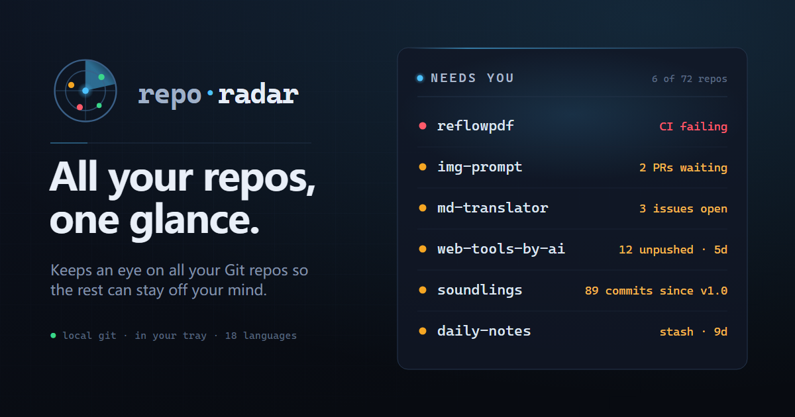

<p align="center">
  
</p>

# repo-radar

> Ein lokales Dashboard, das alle deine Git-Repos im Blick behält und dir zeigt, welche dich brauchen.

[](https://github.com/rockbenben/365opensource)

[English](../../README.md) · [简体中文](README.zh-Hans.md) · [繁體中文](README.zh-Hant.md) · [日本語](README.ja.md) · [한국어](README.ko.md) · [Español](README.es.md) · [Français](README.fr.md) · **Deutsch** · [Português](README.pt.md) · [Русский](README.ru.md) · [Italiano](README.it.md) · [العربية](README.ar.md) · [हिन्दी](README.hi.md) · [বাংলা](README.bn.md) · [ไทย](README.th.md) · [Türkçe](README.tr.md) · [Tiếng Việt](README.vi.md) · [Bahasa Indonesia](README.id.md)

Du hast mehr Git-Repos, als du von Hand im Blick behalten kannst. repo-radar behält sie alle im Auge und zeigt dir die wenigen, die dich jetzt brauchen — damit der Rest dir aus dem Kopf geht.

Es holt hervor, was du sonst zu prüfen vergessen würdest:

- **Repos, die du aus den Augen verloren hast** — jedes Repo, das dir gehört, auf einem Bildschirm, durchsuchbar, jedes davon mit einem Klick geöffnet.
- **Unfertig gebliebene Arbeit** — uncommittete, ungepushte oder gestashte Änderungen, markiert, bevor du sie verlierst.
- **GitHub wartet auf dich** — offene PRs, Issues und fehlschlagende CI über alle Repos hinweg, gesammelt über dein lokales, bereits authentifiziertes `gh`.
- **Projekte, die veralten** — die, die du zu lange nicht angefasst hast, oder die überfällig zum Veröffentlichen sind.

Die, die Handlung erfordern, steigen als Warteschlange an die Spitze des Boards, nach Dringlichkeit sortiert, ein Eintrag pro Repo — klick, um direkt zu handeln. Verwirf mit ✓, und es bleibt weg, bis sich wirklich etwas ändert; wenn nichts wartet, steht dort „all clear“. Der Rest deiner Repos ist immer nur eine Suche entfernt.

## Installation

Schnapp dir die Datei für deine Plattform von [Releases](https://github.com/rockbenben/repo-radar/releases) — kein Node.js nötig. Die App ist nicht codesigniert, daher warnt jedes Betriebssystem beim ersten Start:

- **Windows** — führe `repo-radar-<version>-x64-setup.exe` aus; klicke bei der SmartScreen-Meldung auf *Weitere Informationen → Trotzdem ausführen*.
- **macOS** — öffne `repo-radar-<version>-arm64.dmg` und ziehe die App nach Applications. Beim ersten Mal Rechtsklick → Öffnen; nennt macOS sie beschädigt, entferne das Quarantäne-Flag einmalig mit `xattr -cr /Applications/repo-radar.app`.
- **Linux** — `chmod +x repo-radar-<version>-x86_64.AppImage && ./repo-radar-<version>-x86_64.AppImage`.

Oder aus dem Quellcode starten:

```bash
npm install
npm start
```

Klicke beim ersten Start auf **Scan-Verzeichnisse hinzufügen** (oder ⚙ Einstellungen → Scan-Verzeichnisse) und richte es auf die Ordner, die deine Repos enthalten — kein JSON, kein Neustart; es scannt neu, sobald du speicherst. Die Einstellungen liegen in `~/.repo-radar/config.json`, falls du sie lieber von Hand editierst.

## Das Board

Eine Karte pro Repo — Health-Farbe, Branch, Working-Tree-Aufschlüsselung, ahead/behind, letzter Commit, Tags — mit Ein-Klick **Editor / Terminal / Ordner** auf jeder Karte. Von hier aus kannst du:

- **Finden** — suchen, auf eine Sprache / einen `#tag` / eine Warnleuchte klicken, um zu filtern, sortieren und nach Ordner oder Sprache gruppieren; speichere jeden Filter + Sortierung + Gruppierung als benannte Ansicht. ⌘/Strg-K öffnet einen Launcher.
- **In Batches handeln** — wähle Repos für fetch / pull (`--ff-only`) / push aus oder führe einen Shell-Befehl parallel über sie hinweg aus (mit Dry-Run-Vorschau und Ausgabe pro Repo). Ein fehlschlagendes Repo stoppt nie die übrigen.
- **In ein Repo eintauchen** — das Detail-Panel liefert eine vollständige Health-Aufschlüsselung, Branches wechseln / erstellen / verwerfen, **an Ort und Stelle committen** mit Live-Diff, GitHub-PR & -CI auf Anfrage, letzte Commits, Stashes, eine 12-Wochen-Heatmap und ein Ein-Klick-Aufräumen bereits gemergter Branches — angeboten nur, solange du auf `main`/`master` bist, denn nur dort bedeutet „bereits gemergt“ auch „in den Trunk gemergt“. Das Verwerfen von Änderungen stellt getrackte Dateien wieder her und entfernt ungetrackte, lässt aber Submodul-Inhalte und ungetrackte verschachtelte Git-Repos unangetastet; bleibt etwas übrig, sagt es dir das, statt Erfolg zu melden.
- **Aktuell bleiben** — Der Standardweg zur Aktualisierung ist ein Rescan alle 30 Minuten plus der manuelle Rescan in der Leiste. Auto-Scan per Datei-Überwachung ist **standardmäßig aus** und wird bei Bedarf im Einstellungspanel eingeschaltet: Er ist rein lokal und geht nie ins Netz, aber wenn mehrere Projekte gleichzeitig bauen, läuft der Benachrichtigungspuffer des Kernels ständig über, und jeder Überlauf kostet einen Rescan — für ein Werkzeug zum kurzen Blick darauf, was sich geändert hat, ein zu hoher Dauerpreis. Eingeschaltet gilt: Unter Windows und macOS deckt ein einziger rekursiver Watch pro Scan-Verzeichnis jedes Repo darunter ab, sodass ein hinzugefügtes, gelöschtes oder umbenanntes Repo innerhalb von Sekunden auftaucht; unter Linux werden Repos einzeln überwacht, und `watchLimit` (standardmäßig 200, 0 = unbegrenzt) begrenzt die Anzahl, wobei Favoriten und zuletzt committete Repos Vorrang haben. Bei anhaltenden Überläufen wächst der Abstand der nachholenden Rescans exponentiell (höchstens alle 30 Minuten), und die Watch-Handles werden nicht mehr neu aufgebaut — das passiert nur noch, wenn ein Watch-Ziel tatsächlich verloren ging. Ein Rescan alle 30 Minuten fängt auf, was die Überwachung verpasst, die Leiste zeigt „Zuletzt gescannt“, und das Einstellungspanel zeigt die Abdeckung live als „M von N überwacht“. Ein Repo umzubenennen oder zu verschieben erhält seine Tags, den Stern, den Archivstatus und Notizen — repo-radar verfolgt die Identität, nicht bloß den Pfad. Zugeordnet wird sie im Scan-Durchlauf **direkt nach** dem Verschieben, woraus zwei Lücken bleiben: ein langsames Verschieben über Volume-Grenzen, das zwei Scan-Durchläufe überspannt und dazwischen das Hinzufügen/Entfernen eines anderen Repos oder den periodischen Rescan erwischt; und ein Verschieben, dessen Ziel in diesem Durchlauf nicht gescannt wird — ein Repo aus den Scan-Verzeichnissen heraus zu verschieben und sein neues Zuhause erst später als Scan-Verzeichnis hinzuzufügen ist der übliche Weg dorthin. Beide fallen auf die pfadbasierte Identität zurück: das Repo kommt als frische Karte zurück, und Tags/Stern/Archiv/Notizen bleiben unter der id liegen, die es nicht mehr hat. Der geplante Hintergrund-Fetch ist opt-in. Ein **Stats**-Tab (jahresübergreifende Commit-Heatmap, aktivste/inaktivste) und ein **Worklog**-Tab, der einen Zeitraum als Markdown-Wochenbericht kopiert.
- **Repos starten & verschieben** — **+ New** schlägt das nächste nummerierte Projekt vor, führt `git init` aus, schreibt eine README und übernimmt es ins Board; Manifest-Export / -Import trägt deine Einrichtung von Rechner zu Rechner.

Die UI ist antd 6 in einem dunklen Instrumenten-Cockpit-Theme, in 18 Sprachen lokalisiert (beim ersten Besuch automatisch an deinen Browser angeglichen, RTL für Arabisch).

## Läuft leise im Hintergrund

Das Fenster zu schließen legt repo-radar in den Tray, sodass der Rescan, die Datei-Überwachung (falls eingeschaltet), geplante Fetches und GitHub-Benachrichtigungen weiterlaufen — klick auf das Tray-Symbol, um das Board zurückzuholen, oder beende es wirklich über das Tray-Menü. (Unter Linux, wo Desktop-Trays nicht zuverlässig sind, beendet das Schließen stattdessen; nutze Bei der Anmeldung starten, um es resident zu halten.)

Beim Beenden wartet repo-radar bis zu 10 Sekunden auf bereits laufende Git-Arbeit — ein Batch-Pull, ein verworfener Stash, ein geplanter Fetch — damit nichts mitten im Schreiben abgeschnitten wird und eine veraltete `.git/index.lock` hinterlässt. Reicht die Zeit nicht, beendet es sich trotzdem und schreibt das ins Log: das ist die einzige Stelle, die eine später gefundene `index.lock` erklärt.

Schalte **Bei der Anmeldung starten** in ⚙ Einstellungen ein, und es startet headless mit deiner Sitzung — kein Fenster, bis du danach verlangst. Optionale Desktop-Benachrichtigungen feuern nur, wenn etwas *Neues* deine Warteschlange erreicht, auch bei geschlossenem Fenster. Upgrades sind bewusst manuell (kein Auto-Update): führe den neuen Installer über den alten aus. Logs landen in `<config dir>/logs/repo-radar.log`.

## Konfiguration

Alles, was die UI berührt, wird in `~/.repo-radar/config.json` gespeichert — du musst sie selten öffnen. Die Felder, die zählen:

| Feld | Was es bewirkt |
| --- | --- |
| `roots` / `excludes` / `manualRepos` | wo gescannt wird (findet `.git` bis 6 Ebenen tief, folgt keinen Symlinks), was übersprungen wird, und außerhalb der Roots hinzugefügte Repos — ein `manualRepos`-Eintrag, der umbenannt oder verschoben wird, wird nicht wie ein gescanntes Repo über die Identität verfolgt; die Karte bleibt im Fehlerzustand, bis du hier den Pfad aktualisierst, und liegt das Verschieben mehr als einen Scan-Durchlauf zurück, bringt diese Aktualisierung die Karte zurück, aber nicht ihre Tags/Stern/Archiv/Notizen |
| `health` | `{ staleDays, disabledRules }` — passe den „stale“-Schwellenwert an oder deaktiviere einzelne Checks |
| `open` | Befehlsvorlagen für die Buttons Editor / Terminal / Ordner (`{path}` = der Repo-Pfad) |
| `autoWatch` / `autoScanMinutes` / `watchLimit` / `autoFetchMinutes` / `notifications` | Hintergrundverhalten — standardmäßig an ist nur `autoScanMinutes` (30); die anderen drei, `autoWatch` eingeschlossen, sind aus. `watchLimit` (200, 0 = unbegrenzt) gilt **nur unter Linux**, wo Repos einzeln überwacht werden; Windows und macOS nutzen einen rekursiven Watch pro Scan-Verzeichnis und decken immer jedes Repo ab |
| `tags` / `favorites` / `groupOverrides` / `notes` / `archived` | Organisation pro Repo |

Neben `config.json` liegen zwei weitere Dateien, beide gefahrlos löschbar — repo-radar baut sie neu auf, nur zu unterschiedlichen Kosten. `repo-cache.json` merkt sich die „schweren“ Git-Felder jedes Repos (Stashes, Tags, Remotes, gemergte Branches …), verschlüsselt über einen `.git`-Fingerprint, sodass ein unverändertes Repo diese Git-Aufrufe beim nächsten Rescan überspringt; löschst du sie, wird der nächste Rescan einfach einmal langsamer. `repo-identity.json` ist das Identitäts-Ledger, dank dem ein umbenanntes oder verschobenes Repo seine Tags, den Stern, den Archivstatus und Notizen behält, statt als brandneues Repo zu gelten. Hier ist der Verlust unmittelbar, nicht aufgeschoben: jedes Repo, das **vor** dem Verlust der Datei schon umbenannt oder verschoben wurde, bekommt beim nächsten Scan eine brandneue id, und seine Tags/Stern/Archiv/Notizen bleiben unter der id gestrandet, die es nicht mehr hat. Nie umbenannte Repos sind unberührt, und ab dem Moment, in dem das Ledger neu aufgebaut ist, sind Umbenennungen wieder geschützt.

`REPO_RADAR_CONFIG` und `REPO_RADAR_PORT` (Standard 17420) überschreiben Konfigurationspfad und Port — setze **beide**, um eine zweite, vollständig unabhängige Instanz zu betreiben. Der Server bindet nur `127.0.0.1` und validiert den Origin-Header bei jeder API- und WebSocket-Anfrage.

Der Standardport liegt bewusst oberhalb des dynamischen Portbereichs des Betriebssystems: Windows nutzt standardmäßig 49152–65535, nach der Installation von Hyper-V/WSL2 aber 1024–15000 — und das System reserviert ganze Blöcke aus dem jeweils aktiven Bereich. Ein Port darin scheitert beim Binden mit `EACCES`, und die Blöcke verschieben sich über Neustarts hinweg.

Lässt sich der **Standard**port nicht binden, weicht repo-radar aus (`+1000`, `+2000`, `+3000`, dann ein vom System vergebener Port), statt den Start zu verweigern, merkt sich den gefundenen Port für spätere Starts und zeigt ihn in ⚙ Einstellungen neben der Version. Das Merken ist wichtig, weil der Port Teil der Origin der Seite ist und das Board gespeicherte Ansichten, Aktivitätsprotokoll, Theme und Sprache im Origin-gebundenen Browser-Speicher hält — ein hin- und herspringender Port ließe diese Daten scheinbar verschwinden und wiederkehren. Zum Zurückwechseln auf den Standardport `<Konfigurationsverzeichnis>/port-state.json` löschen.

Ein selbst über `REPO_RADAR_PORT` gesetzter Port wird nie ersetzt — er ist ein Versprechen an Lesezeichen, Reverse-Proxy-Upstreams und Skripte, deshalb schlägt ein nicht bindbarer Port hörbar fehl. Ebenso bei `npm run dev`, wo das Proxy-Ziel von vite beim Laden der Konfiguration festgelegt wird.

## Entwicklung

```bash
npm run dev     # vite + das App-Fenster mit Hot Reload
npm test        # Server-, Web- und Desktop-Testsuiten sowie Typechecks
npm run dist    # baut Installer nach dist-electron/
```

Stack: Electron-Shell + Node + Hono (jeglicher Git-Zugriff über `spawn`, keine nativen Abhängigkeiten) + Vite / React 19 / antd 6, mit chokidar + WebSocket für Live-Updates. Der Hono-Server läuft im Hauptprozess von Electron, und das Fenster lädt ihn über `127.0.0.1` — die UI ist also reines HTTP + WebSocket, genau wie im Browser.

## Über den 365 Open Source Plan

Projekt **#027** des [365 Open Source Plan](https://github.com/rockbenben/365opensource) — eine Person + KI, über 300 Open-Source-Projekte in einem Jahr. [Reiche deine Idee ein →](https://365.aishort.top/) · [Discord](https://discord.gg/PZTQfJ4GjX) · [Telegram](https://t.me/aishort_top)