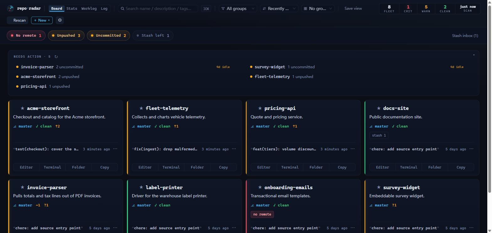

  

# repo-radar

> すべてのGitリポジトリを見守り、どれにあなたの対応が必要かを知らせるローカルダッシュボード。

[English](../../README.md) · [简体中文](../../README.zh.md) · [繁體中文](README.zh-Hant.md) · **日本語** · [한국어](README.ko.md) · [Español](README.es.md) · [Français](README.fr.md) · [Deutsch](README.de.md) · [Português](README.pt.md) · [Русский](README.ru.md) · [Italiano](README.it.md) · [العربية](README.ar.md) · [हिन्दी](README.hi.md) · [বাংলা](README.bn.md) · [ไทย](README.th.md) · [Türkçe](README.tr.md) · [Tiếng Việt](README.vi.md) · [Bahasa Indonesia](README.id.md)

[⬇ Windows · macOS · Linux 版をダウンロード](https://github.com/rockbenben/repo-radar/releases/latest)

手作業で把握しきれないほど Git リポジトリが増えています。repo-radar はそのすべてを見守り、いま対応が必要な数個だけを見せます——残りは忘れていて構いません。

放っておくと確認し忘れるものを拾い上げます：

- **やり残した作業** —— 未コミット・未プッシュ・stash した変更を、失う前に知らせます。
- **GitHub があなたを待っている** —— open な PR、issue、落ちた CI を、ログイン済みの `gh` 経由で読み取ります。
- **放置されつつあるプロジェクト** —— 長く触れていないもの、リリースが遅れているもの。
- **見失ったリポジトリ** —— すべてを一画面に、検索でき、ワンクリックで開けます。

対応が必要なものはキューとして先頭に上がります。1 リポジトリにつき 1 件、緊急度順。✓ で消すと、実際に状況が変わるまで戻ってきません。

## 対応環境

| 項目 | Windows | macOS | Linux |
| --- | --- | --- | --- |
| インストール | `.exe` インストーラ | `.dmg` | `.AppImage` |
| ウィンドウを閉じる | トレイに常駐 | トレイに常駐 | 終了します——常駐させるには**ログイン時に起動** |
| 変更の監視 | スキャン対象配下のすべてのリポジトリ | 同左 | 先頭 200 個まで（上限は設定で変更・解除できます）|

すべてあなたのマシン上で動き、すでに入っている `git` を使います——アカウント不要、テレメトリなし、何もアップロードしません。GitHub の列（PR・issue・CI）は任意で、ログイン済みの [`gh` CLI](https://cli.github.com/) 経由で読みます。使わなくても残りは動きます。

## インストール

[Releases](https://github.com/rockbenben/repo-radar/releases) からお使いのプラットフォームのファイルを取得してください——Node.js は不要です。コード署名をしていないため、初回起動時に各 OS が警告します：

- **Windows** —— SmartScreen で*詳細情報 → 実行*。
- **macOS** —— 初回は右クリック → 開く。「壊れている」と言われたら `xattr -cr /Applications/repo-radar.app`。
- **Linux** —— 先に `chmod +x repo-radar-*.AppImage`。

バイナリを信用したくない？[自分でビルド](../development.md)——`npm install && npm start` だけです。

初回起動時に **スキャン対象を追加** を押し、リポジトリが*入っている*親フォルダ（`~/Projects` など）を指定します——1 つずつ追加するのではありません。そこから 6 階層まで下って `.git` を含むものを探し、ボードが埋まります。JSON も再起動も不要です。

## ボード

1 リポジトリ 1 カード——健康度の色・ブランチ・作業ツリーの内訳・ahead/behind・最終コミット・タグ——各カードに **エディタ / ターミナル / フォルダ** のワンクリック。

- **見つける** —— 検索、または言語・`#tag`・シグナルランプで絞り込み。⌘/Ctrl-K でランチャー。
- **ビューを保存** —— 絞り込み + 並び替え + グルーピングに名前を付けて再利用。
- **まとめて操作** —— 選んだリポジトリへ fetch / pull / push、または同じシェルコマンドを一括実行。1 つ失敗しても残りは止まりません。
- **その場で処理** —— 詳細パネルでライブ diff 付きコミット、ブランチ切り替え、変更の破棄、マージ済みブランチの整理、GitHub の PR と CI の取得。
- **作る・移す** —— **＋新規** はリポジトリを作ってそのままボードに載せます。マニフェストの書き出し / 読み込みで環境間を移行できます。

上部のランプは警告の種類です——リモートなし・未プッシュ・未コミット・リモートより遅れ・stash 残り。不要なものは ⚙ 設定でオフにできます。

タブがもう 2 つ：**統計**（1 年分のコミットヒートマップ、最も / 最も動いていないリポジトリ）と **作業記録**（期間を Markdown の週報としてコピー）。

ダークな計器盤テーマ、18 言語に対応、ライト・ダーク両テーマとも文字コントラストを WCAG AA に合わせています。

## 最新に保つ

既定は 30 分ごとのフォールバック再スキャンと、ツールバーからの手動再スキャン——ローカルのみ、静かで、ネットワークを使いません。

ファイル監視による自動スキャンは**既定でオフ**、設定から有効にします。これもローカル限定ですが、複数のプロジェクトが同時にビルド中だとカーネルの通知バッファが溢れ続け、溢れるたびに再スキャンが必要になります——「何が変わったか一目見る」ためのツールには高すぎる常時コストです。有効にすると、リポジトリの追加・削除・改名が数秒で反映されます。

リポジトリを改名・移動しても、タグ・お気に入り・アーカイブ状態・メモは保たれます。repo-radar は中身で見分けており、置き場所では見分けていないので、移動しても新しい別物ではなく同じプロジェクトのままです。

定期的なバックグラウンド fetch は任意で、自発的にネットワークへ出る唯一の機能です。

## バックグラウンドで静かに動く

ウィンドウを閉じるとトレイに収まり、再スキャン・監視・GitHub 通知は動き続けます。トレイアイコンでボードを呼び戻すか、トレイメニューから終了します。

終了時は、実行中の git 処理——一括 pull、stash の破棄——を最大 10 秒待ちます。書き込みの途中で切られて `.git/index.lock` が残らないようにするためです。間に合わなければそのまま終了し、その旨をログに残します。

**ログイン時に起動** を有効にすると、セッションと一緒に画面なしで起動します。デスクトップ通知は任意で、*新しい*項目がキューに入ったときだけ鳴ります。

## 設定

スキャン対象・除外フォルダ・開くコマンドは ⚙ 設定 → スキャンと開くコマンド で編集できます。その他は `~/.repo-radar/config.json` にありますが、開く機会はほとんどありません——全フィールド、隣にある 2 つのキャッシュファイル、第 2 インスタンスを動かすための環境変数は[設定リファレンス](../configuration.md)を参照してください。

## 既知の制限

- **アップグレードは意図的に手動です。** 自動更新はありません：新しいインストーラを上書き実行してください。
- **移動したリポジトリは次のスキャンで認識されます——そのスキャンを逃すとタグが付いてきません。** ドライブをまたぐ遅い移動や、移動先をまだスキャン対象に加えていない場合、新しいカードとして現れ、タグは元のカードに残ります。
- **Linux には信頼できるトレイがない**ため、ウィンドウを閉じると終了します。
- **スキャン対象の外に 1 つずつ追加したリポジトリは、この方式で認識されません** —— 移動したらパスを自分で指し直してください。
- **変更の破棄はサブモジュールとネストした git リポジトリには触れません。** その旨を伝え、すべて消えたかのようには報告しません。

## 365オープンソース計画について

[365オープンソース計画](https://github.com/rockbenben/365opensource) の **#027** 番目のプロジェクト——一人 + AIで、1年に300以上のオープンソースプロジェクトを。

[あなたのアイデアを投稿する →](https://365.aishort.top/) · [Discord](https://discord.gg/PZTQfJ4GjX) · [Telegram](https://t.me/aishort_top)
